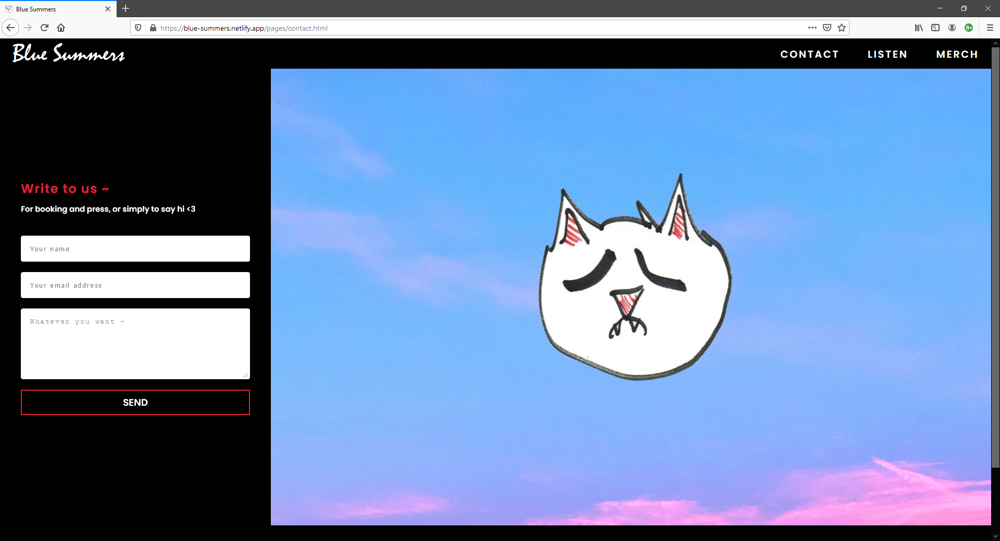

  
# Blue-Summers

A fully responsive website built for the indie band [Blue Summers](https://bluesummers.bandcamp.com/). 
Built entirely on CSS, HTML, and non-zero percent Javascript. 

### Go to the Website
https://blue-summers.netlify.app/

### Screen Shots

### The band

[Blue Summers](https://bluesummers.bandcamp.com/) is a indie rock band formed in Los Angeles. The group is conformed by Jimmy, Josh, Eric, and Matt. 

## The learned 

* Fundamentals of CSS, CSS Media Queries, and CSS Animations.
* Fundamentals of JavaScript ES6.
* Fundamentals of DOM Manipulation with JavaScript ES6.
* Fundamentals of Screen Responsiveness

## The problems

* The website is too simple and repetitive.
* A single html and css file could have been used.
* React or Angular could have been a perfect tool for this project.

## What to improve in later projects

* Create a more interesting UI.
* Avoid repiting code among files.
* Use React.

